<div align="center">

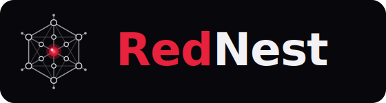

### Manual técnico — Plataforma de **CTI · OSINT · Investigação Digital** (self-hosted)

*Uma plataforma unificada para conduzir investigações: do reconhecimento à correlação de achados, dossiês, evidências e relatórios.*

`NestJS` · `Prisma` · `PostgreSQL` · `Redis / BullMQ` · `Playwright` · `React` · `Vite` · `Zustand` · `Docker`

</div>

> ⚠️ **Uso restrito a investigações autorizadas, CTI defensivo, pesquisa de segurança e fins educacionais.** Leia o [Aviso legal](#14-aviso-legal--uso-ético).
> As imagens deste manual usam **dados 100% fictícios** ("Operação Aurora (DEMO)", "João Fictício da Silva") e alvos públicos/benignos (`example.com`, `wordpress.org`).

---

## 📖 Sumário

1. [Visão geral](#1-visão-geral)
2. [Conceitos fundamentais](#2-conceitos-fundamentais)
3. [Operações & dashboard](#3-operações--dashboard)
4. [Modelo de entidades & atividades](#4-modelo-de-entidades--atividades)
5. [Engajamentos (tipos)](#5-engajamentos-tipos)
6. [Recon & Web](#6-recon--web)
7. [OSINT de identidade](#7-osint-de-identidade)
8. [Threat Intelligence & Vulnerabilidades](#8-threat-intelligence--vulnerabilidades)
9. [Monitoramento](#9-monitoramento)
10. [Proxies](#10-proxies)
11. [Documentação & gestão do caso](#11-documentação--gestão-do-caso)
12. [Arquitetura & stack](#12-arquitetura--stack)
13. [Instalação & configuração](#13-instalação--configuração)
14. [Segurança, aviso legal & licença](#14-aviso-legal--uso-ético)

---

## 1. Visão geral

**RedNest** foi desenhado como uma **plataforma de investigação**, e não um "launcher" de ferramentas. Cada ferramenta é uma **engine interna** que devolve resultados **estruturados** — que viram *achados* persistidos, navegáveis e correlacionáveis. As engines conversam entre si por um **Event Bus (Timeline)** e alimentam um **modelo de entidades unificado** por operação, onde *cada informação existe uma única vez* (alimentando Alvos, grafo de relacionamentos e Threat Score).

Principais pilares:

- **Investigação estruturada** — operações, engajamentos e achados, tudo correlacionado.
- **Cobertura ampla** — recon web, OSINT de identidade, threat intel, vulnerabilidades, monitoramento.
- **Self-hosted** — sobe com um `docker compose up`, sem depender de nuvem.
- **Operacional** — dashboards, execuções ao vivo (SSE), export de PDF/JSON, alertas no Telegram.

<div align="center">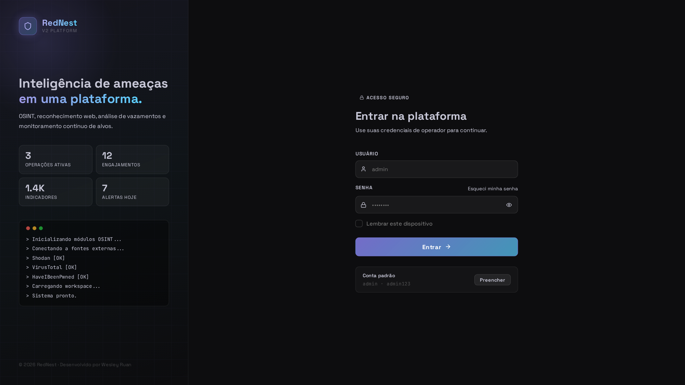</div>

---

## 2. Conceitos fundamentais

| Conceito | Descrição |
|---|---|
| **Operação** | O caso/investigação. Tem status (em andamento / concluída / arquivada), prioridade, tags, objetivo, KPIs e **Threat Score**. |
| **Engajamento** | Um **alvo** dentro da operação. Cada tipo (Web, Domínio, Infra, OSINT, Pessoa…) expõe um conjunto de ferramentas adequado. |
| **Achado** (finding) | Tudo que as engines descobrem: subdomínios, hosts, e-mails, perfis, IOCs, vazamentos, credenciais, CVEs, tecnologias, capturas… |
| **Entidade / Alvo** | Agregação deduplicada dos achados por operação — a base do grafo de relacionamentos e do Threat Score. |
| **Event Bus / Timeline** | Toda ação relevante vira um evento (achado salvo, engine iniciada/concluída, correlação, alerta…). |

---

## 3. Operações & dashboard

O painel da operação reúne **KPIs** (engajamentos, alvos, IOCs, vulnerabilidades, evidências, **Threat Score** e tempo total), um **mapa de engajamentos**, **atividades recentes** e a lista de engajamentos. Pelo menu **⋯** você altera o status (Em andamento / Concluída / Arquivada).

<div align="center">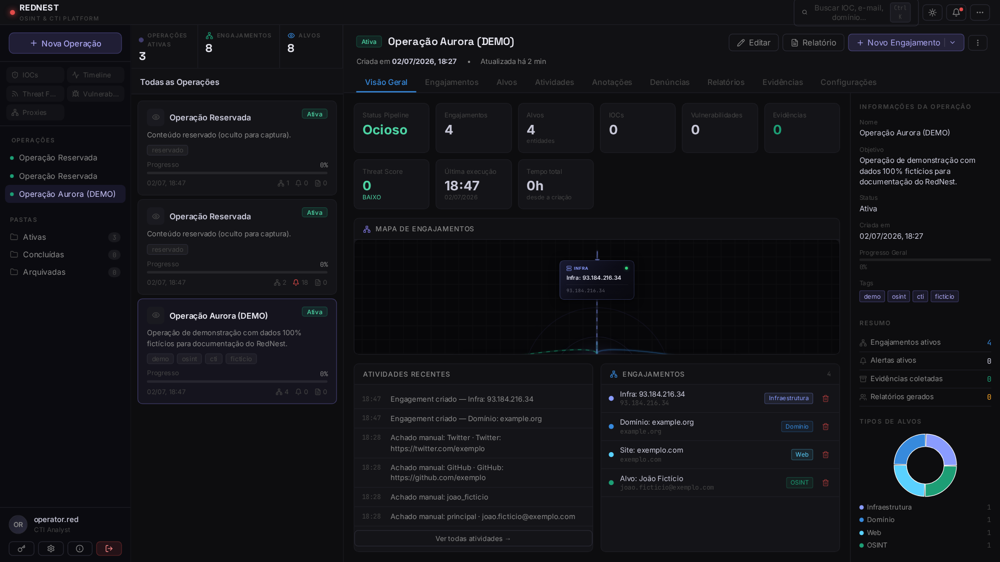</div>

---

## 4. Modelo de entidades & atividades

A aba **Alvos** mostra o **modelo de entidades unificado** — tudo que qualquer engine descobriu, deduplicado por tipo/valor, com alternância **Lista / Grafo** de relacionamentos. A aba **Atividades** é o *Event Viewer* da operação (Investigation Event Bus).

<table>
<tr>
<td width="50%">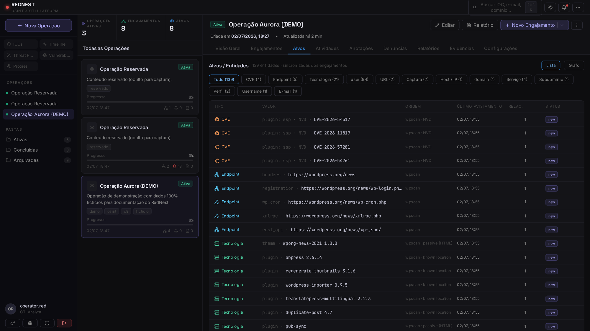<p align="center"><sub>Alvos — entidades unificadas</sub></p></td>
<td width="50%">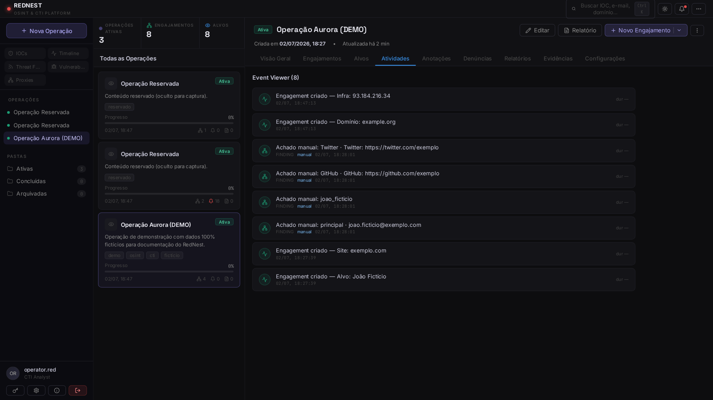<p align="center"><sub>Atividades — Event Bus</sub></p></td>
</tr>
</table>

---

## 5. Engajamentos (tipos)

Cada engajamento tem um **tipo** que define suas ferramentas:

- **Web** — Recon Pipeline, WordPress Scan, Análise de Website, Tecnologias, DNS, Subdomínios, Service Scan, Content Discovery, Crawler, Check-Host, Wayback, Capturas de Tela, Visão Geo-distribuída, Monitoramento.
- **Domínio** — Recon Pipeline, WHOIS/DNS, Atribuição de Domínio, Subdomínios, Service Scan, ASN, Wayback…
- **Infra** — Threat Intel, Service Scan, Check-Host distribuído, ASN & Roteamento.
- **OSINT / Pessoa** — Pessoa (Dossiê), E-mails & Usuários, Username Search, Redes Sociais, Vazamentos, Google Dorks.

---

## 6. Recon & Web

### 6.1 Recon Pipeline

Encadeia as engines automaticamente sobre o alvo: **Subdomínios → HTTP Discovery → Service Scan → Screenshots → Correlação de CVEs**. Acompanhamento **ao vivo** com stepper por fase, duração por etapa, KPIs com mini-gráficos, e controle de execução (cancelar). Tudo é salvo como achados.

<div align="center">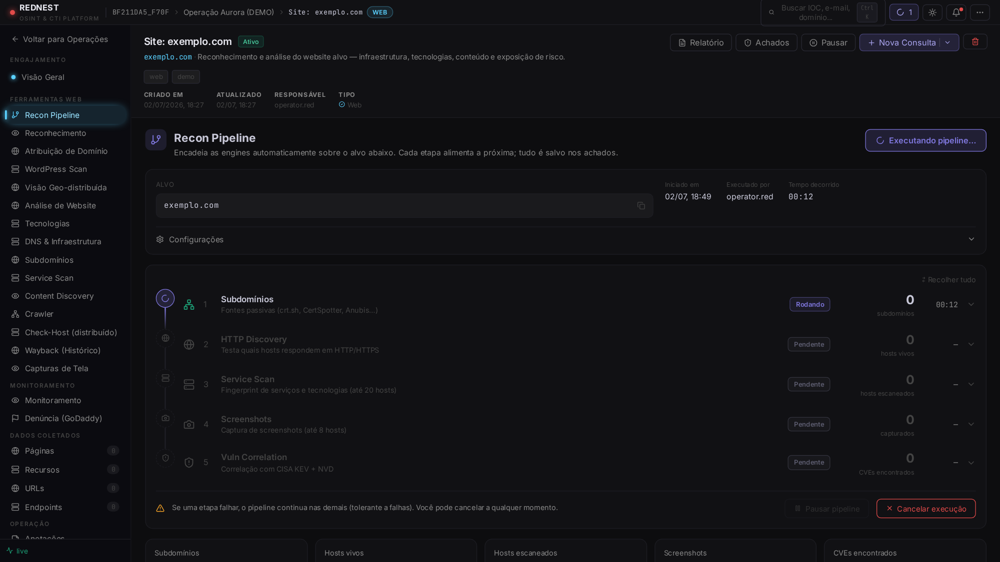</div>

### 6.2 WordPress Engine (estilo WPScan, nativo)

Scanner completo de WordPress (sem chamar binário externo): detecção + versão do core, **usuários** (REST/oEmbed/author brute/sitemap), **plugins & temas** (passivo + wordlist + namespaces REST, com versão), **achados sensíveis** (xmlrpc, debug.log, config backups, DB dumps, registro aberto…) e **correlação de CVE** com **NVD + CISA KEV**. Inclui bypass de desafios anti-bot e opção de rotear por proxy.

<div align="center">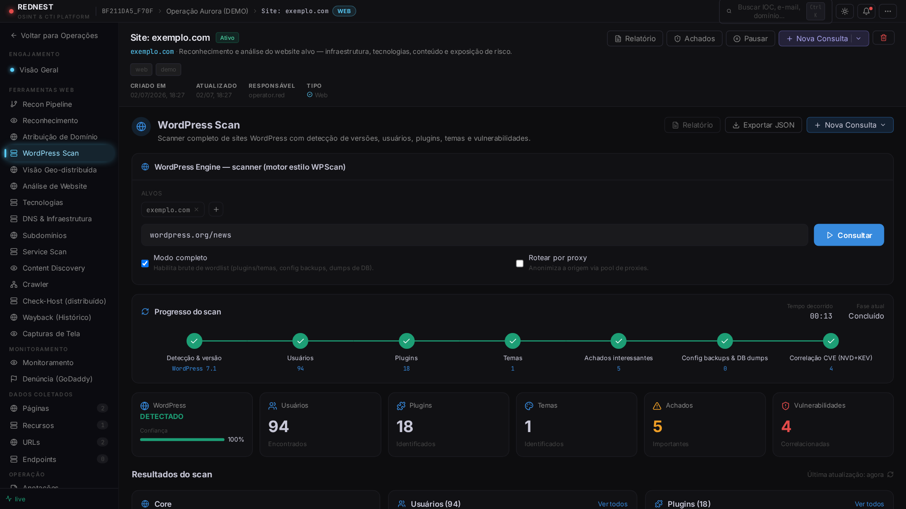</div>

### 6.3 Atribuição de Domínio

Pipeline **WHOIS/RDAP → resolução de IP → hosting (ipinfo)**: registrador, datas, e-mail de abuso, registrante, nameservers, e IP/ASN/organização/país do servidor.

<div align="center">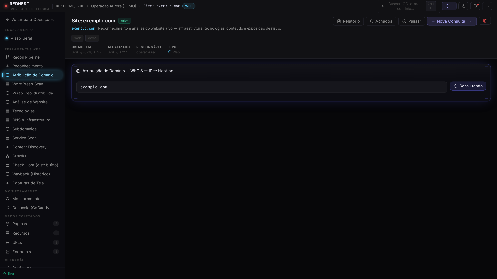</div>

### 6.4 Content Discovery · Service Scan · Crawler · Screenshot Engine

<table>
<tr>
<td width="50%">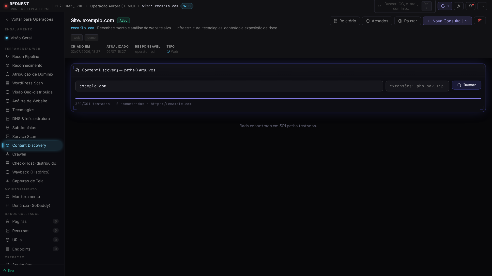<p align="center"><sub>Content Discovery (estilo Gobuster) — paths/arquivos, filtro de status, detecção de falso-positivo</sub></p></td>
<td width="50%">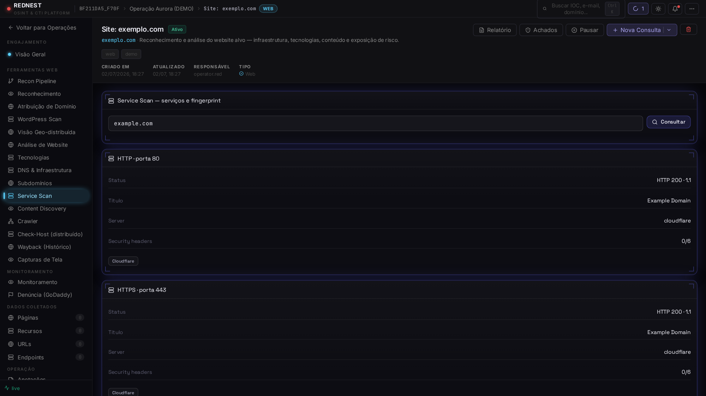<p align="center"><sub>Service Scan — HTTP/TLS/SSH/FTP, tecnologias, certificados</sub></p></td>
</tr>
<tr>
<td width="50%">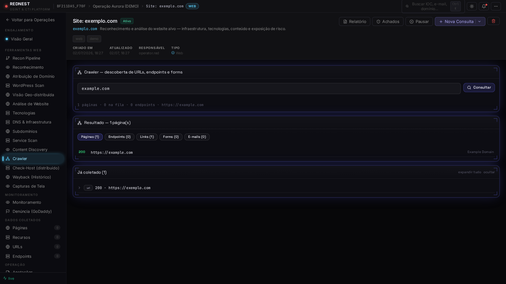<p align="center"><sub>Crawler (estilo Katana) — URLs, endpoints, forms, e-mails</sub></p></td>
<td width="50%">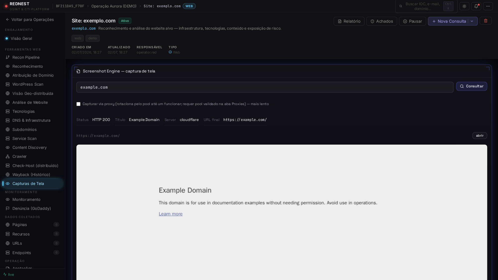<p align="center"><sub>Screenshot Engine — Chromium, rotação por proxy, bypass de anti-bot</sub></p></td>
</tr>
</table>

Ainda em Recon & Web: **Subdomínios** passivos (crt.sh/CertSpotter/Anubis), **Check-Host** distribuído, **Wayback Machine** e **Visão Geo-distribuída** (anti-cloaking — compara a resposta do alvo por vários países via proxy).

---

## 7. OSINT de identidade

### 7.1 E-mails & Usuários

Consulta **dinâmica em paralelo** (status ao vivo por fonte): **Gravatar · Hunter · holehe · Leak-Lookup · COMB**. Você escolhe consultar um alvo salvo ou um novo, e decide **o que salvar** no engajamento (o alvo, vazamentos, credenciais, perfil…).

<div align="center">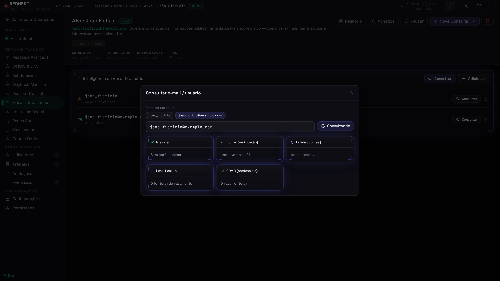</div>

### 7.2 Username Search (WhatsMyName)

Busca de **username em ~700 sites** com progresso em tempo real (SSE) e perfis agrupados por categoria.

<div align="center">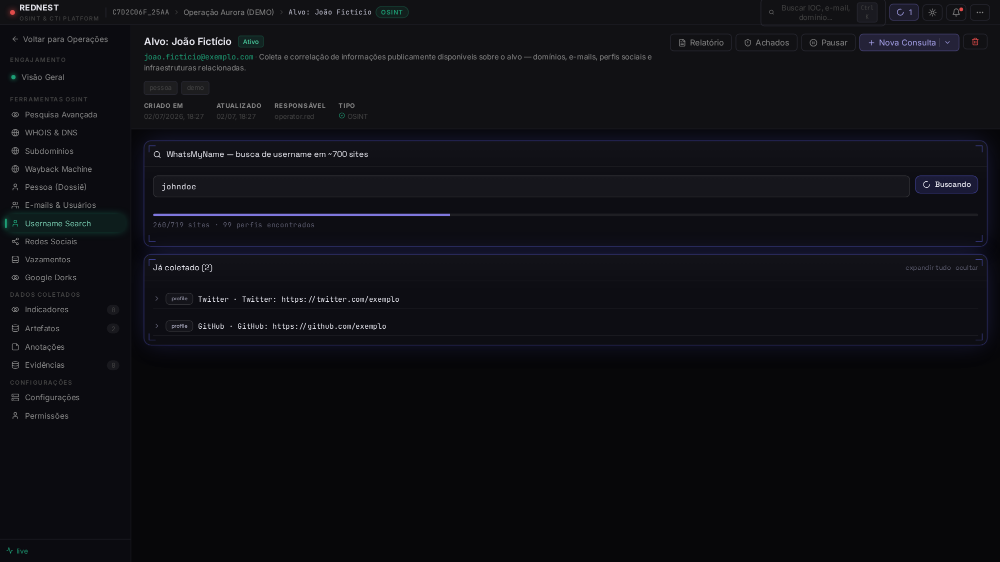</div>

### 7.3 Pessoa (Dossiê)

Ficha OSINT **completa** de pessoa: identidade, documentos, históricos (residencial/profissional/acadêmico), empresas, patrimônio, judicial, presença digital/técnica, relacionamentos, linha do tempo, mídia e resumo executivo — com **foto, idade automática** e **exportação em PDF**.

<div align="center">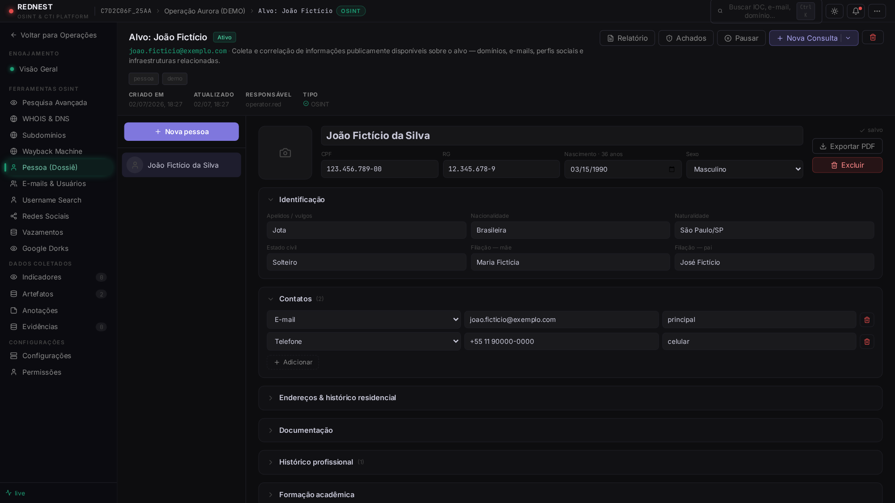</div>

### 7.4 Google Dorks

<div align="center">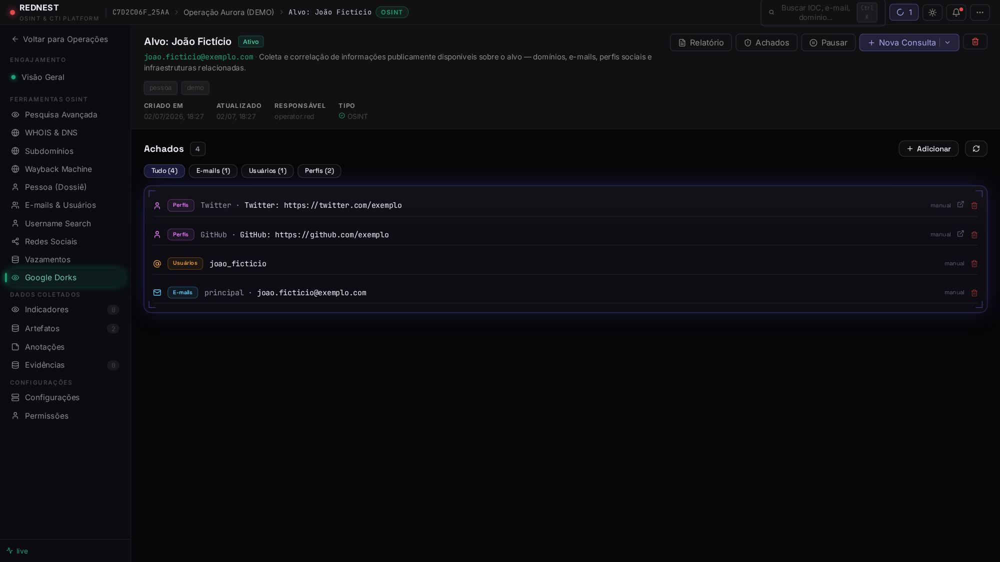</div>

---

## 8. Threat Intelligence & Vulnerabilidades

- **IOCs** — enriquecimento (VirusTotal / AbuseIPDB / OTX / ThreatFox), veredito e correlação.
- **Threat Feeds** — CISA KEV, RSS e fontes de inteligência.
- **Vulnerabilidades (NVD)** — base sincronizada, dashboard de CVEs (severidade, CVSS, top vendors, busca).
- **Correlation Engine** — domínio→IP→ASN→threat e tecnologia→CVE (KEV + NVD).

<table>
<tr>
<td width="50%">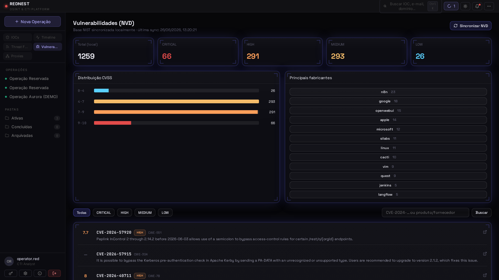<p align="center"><sub>Vulnerabilidades (NVD)</sub></p></td>
<td width="50%">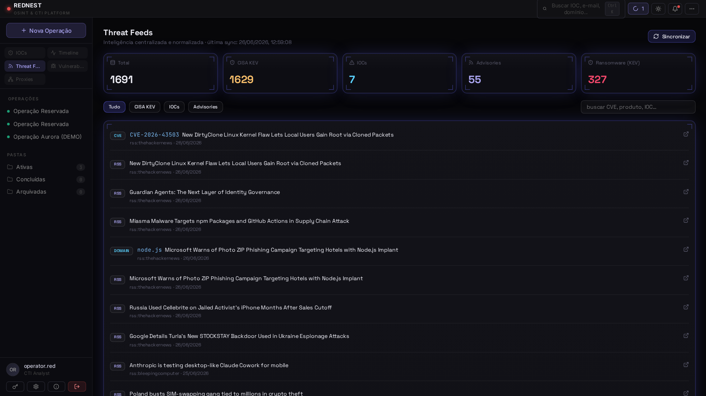<p align="center"><sub>Threat Feeds (KEV / RSS)</sub></p></td>
</tr>
</table>

---

## 9. Monitoramento

Monitores de **mudança de conteúdo** (hash + diff + captura por execução) e **re-checagem de IOCs**, agendados via **BullMQ/Redis**. Alertas por **Telegram** (mudança, falha ao capturar, recuperação) e opção de **monitorar via proxy** (anonimiza a origem).

---

## 10. Proxies

Pool **global** de proxies (HTTP / SOCKS4 / SOCKS5): importar do ProxyScrape, colar listas próprias ou **subir arquivo**; **validar** (vivo, latência, país, anonimato); **testar** individualmente; **rotear** a saída das engines; e **checagem geo-distribuída** (anti-cloaking).

<div align="center">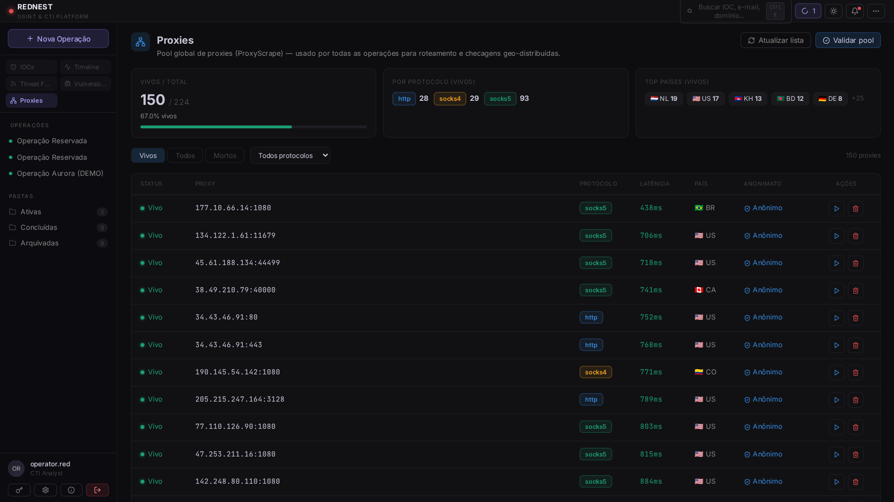</div>

---

## 11. Documentação & gestão do caso

- **Denúncias** — rastreio de abuse reports (alvo, plataforma/órgão, ID/ticket, categoria, status, prioridade), com KPIs.
- **Anotações** — notas com prioridade, status e prazo (por operação e por engajamento).
- **Evidências** — anexos do caso.
- **Relatórios** — geração de relatórios da operação.

<table>
<tr>
<td width="50%">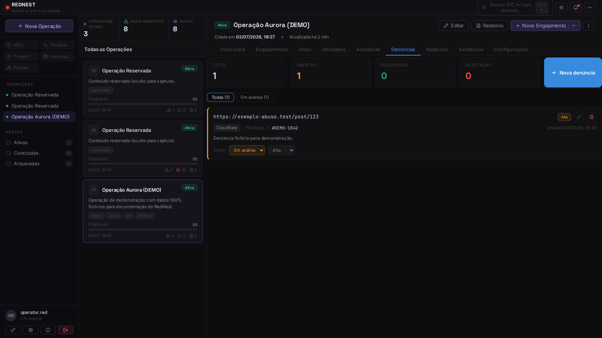<p align="center"><sub>Denúncias — abuse tracking</sub></p></td>
<td width="50%">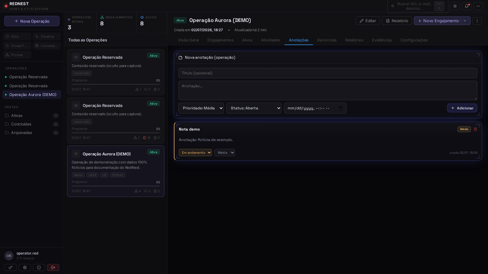<p align="center"><sub>Anotações do caso</sub></p></td>
</tr>
</table>

---

## 12. Arquitetura & stack

```
 Frontend (React/Vite/Zustand, nginx)  ──HTTP/SSE──►  Backend (NestJS/Prisma)
                                                          │  engines · event bus · Playwright
                                                          ├─►  PostgreSQL
                                                          ├─►  Redis (BullMQ — filas/monitoramento)
                                                          └─►  Chromium (screenshots, anti-bot)
   Observabilidade:  Prometheus · Grafana · Tempo · Alertmanager
```

| Camada | Tecnologias |
|---|---|
| **Backend** | NestJS 11, Prisma 6, PostgreSQL 17, Redis + BullMQ, Playwright, JWT (access+refresh), RBAC, rate-limit, OpenTelemetry |
| **Frontend** | React 18, Vite, TypeScript, Zustand, ReactFlow (grafo), Recharts, SSE |
| **Infra** | Docker Compose, nginx (SPA + proxy `/api` + SSE) |

---

## 13. Instalação & configuração

**Pré-requisitos:** Docker + Docker Compose.

```bash
git clone https://github.com/wesleyruam/rednest.git
cd rednest

# ambiente — copie os exemplos e AJUSTE os segredos
cp .env.example .env
cp backend/.env.example backend/.env
#  troque: JWT_ACCESS_SECRET, JWT_REFRESH_SECRET, INTEGRATIONS_SECRET,
#          SEED_ADMIN_PASSWORD e (opcional) TELEGRAM_BOT_TOKEN / TELEGRAM_CHAT_ID

docker compose up -d --build
```

Acesse **http://localhost:8090** — login inicial `admin` / `admin123` (**troque em produção**). Grafana (opcional) em `http://localhost:3001`.

### Estrutura do repositório

```
rednest/
├─ src/                 Frontend (componentes, páginas, services, store)
├─ backend/
│  ├─ src/              Módulos NestJS (auth, operations, engagements, findings,
│  │                    integrations, engines, monitoring, proxy, persons,
│  │                    complaints, timeline, nvd…)
│  └─ prisma/           Schema + migrações
├─ monitoring/          Prometheus, Grafana, Tempo, Alertmanager
├─ docs/screenshots/    Capturas (dados fictícios)
├─ docker-compose.yml   Stack completa
├─ nginx.conf           SPA + proxy /api + SSE
└─ README.md / README.txt
```

### Variáveis de ambiente principais

| Variável | Descrição |
|---|---|
| `JWT_ACCESS_SECRET` / `JWT_REFRESH_SECRET` | Segredos de assinatura dos tokens JWT |
| `INTEGRATIONS_SECRET` | Chave AES-256-GCM que cifra as chaves de provedores externos no banco |
| `DATABASE_URL` | Conexão PostgreSQL |
| `REDIS_HOST` / `REDIS_PORT` | Redis (filas de monitoramento) |
| `SEED_ADMIN_*` | Usuário admin inicial |
| `TELEGRAM_BOT_TOKEN` / `TELEGRAM_CHAT_ID` | Notificações (opcional) |

---

## 14. Aviso legal & uso ético

RedNest foi construído para investigações **autorizadas**, resposta a incidentes, threat intelligence defensivo, pesquisa de segurança e educação.

Você é **o único responsável** por como a utiliza. Investigue/consulte apenas alvos para os quais tenha **autorização legal**. Respeite as leis aplicáveis (incluindo **LGPD/GDPR**), os termos de serviço das fontes e os direitos de terceiros. **Não** use para assédio, perseguição (stalking), doxxing, acesso não autorizado, ataques ou qualquer atividade ilegal. Os autores não se responsabilizam por uso indevido.

### 🔒 Segurança & privacidade

- Segredos **não** versionados (`.env`, `backend/.env` no `.gitignore`; use os `*.env.example`).
- Chaves de provedores externos guardadas **cifradas (AES-256-GCM)** no banco.
- JWT (access curto + refresh rotacionado), **RBAC**, rate-limiting, logout automático em sessão expirada.
- Dados de investigação vivem no **volume do PostgreSQL**, fora do repositório.
- Proxies públicos: só para **GET de recon** não autenticado — nunca envie credenciais por eles.

### 📄 Licença

A definir pelo autor (ex.: MIT). Enquanto não houver arquivo `LICENSE`, todos os direitos reservados ao proprietário do repositório.

---

<div align="center"><sub><b>RedNest</b> · OSINT & CTI Platform · feito para investigação digital autorizada</sub></div>
