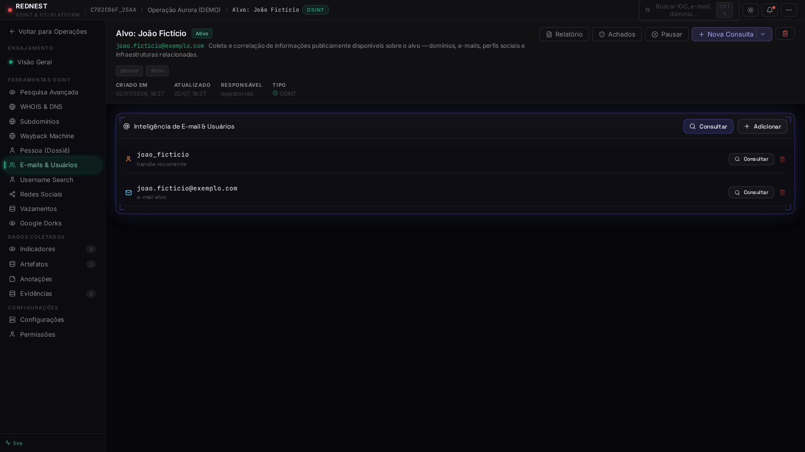
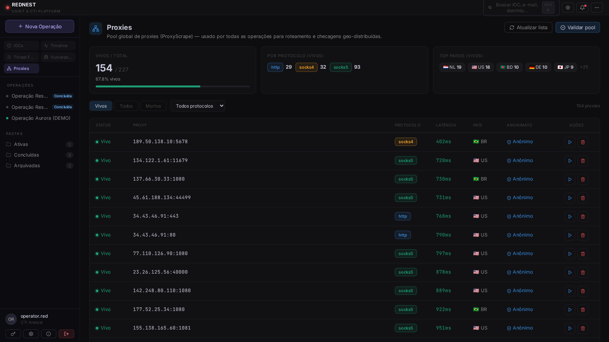
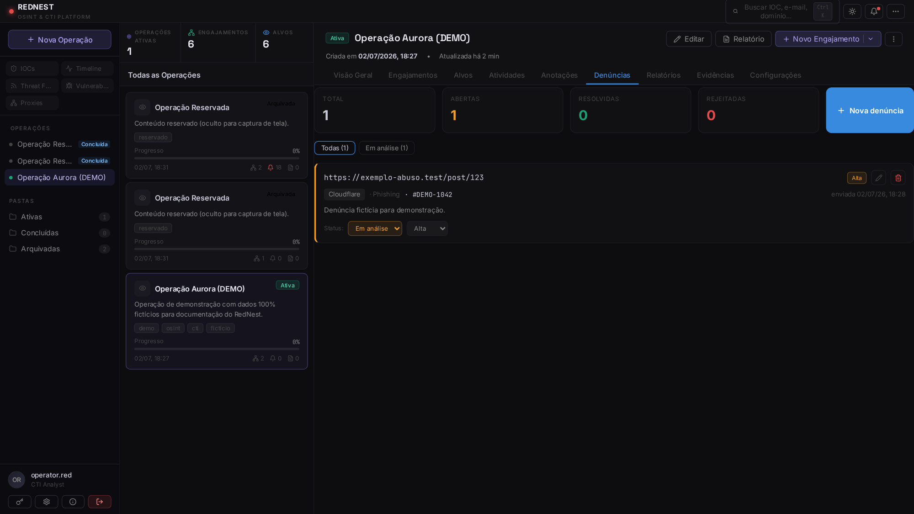

<div align="center">

# 🕸️ RedNest

### Plataforma de **CTI · OSINT · Investigação Digital** — self-hosted

*Do reconhecimento inicial à correlação de achados, dossiês, evidências e relatórios — tudo em uma plataforma unificada.*

`NestJS` · `Prisma` · `PostgreSQL` · `Redis/BullMQ` · `Playwright` · `React` · `Vite` · `Zustand` · `Docker`

</div>

> ⚠️ **Uso restrito a investigações autorizadas, CTI defensivo, pesquisa de segurança e fins educacionais.** Veja o [Aviso legal](#-aviso-legal--uso-ético).

---

## ✨ Visão geral

RedNest é uma **plataforma de investigação**, não um "launcher" de ferramentas. Cada ferramenta é uma **engine interna** que produz resultados **estruturados** — que viram *achados* persistidos, navegáveis e correlacionáveis. As engines conversam por um *Event Bus* (Timeline) e alimentam um **modelo de entidades unificado** por operação (Alvos, grafo, Threat Score), onde *cada informação existe uma única vez*.

- **Operação** → o caso/investigação (status, prioridade, tags, KPIs, Threat Score).
- **Engajamento** → um alvo dentro da operação (Web · Domínio · Infra · OSINT · Pessoa…), com ferramentas por tipo.
- **Achados** → subdomínios, hosts, e-mails, perfis, IOCs, vazamentos, credenciais, CVEs, tecnologias, capturas…

## 📸 Screenshots

<div align="center">

| Dashboard da Operação | Pessoa (Dossiê OSINT) |
|:--:|:--:|
|  |  |
| **Inteligência de E-mail & Usuários** | **Pool de Proxies** |
|  |  |
| **Denúncias / Abuse tracking** | **Login** |
|  |  |

<sub>Todas as capturas usam **dados 100% fictícios**.</sub>

</div>

## 🚀 Capacidades

<table>
<tr><td valign="top" width="50%">

**Investigação & gestão**
- Operações/engajamentos com status, prioridade, tags e KPIs
- Modelo de entidades unificado + grafo de relacionamentos
- Timeline / Investigation Event Bus
- Anotações, Evidências, Relatórios e **Denúncias** (abuse tracking)

**Recon & Web**
- **Recon Pipeline** (Subdomínios → HTTP → Service Scan → Screenshots → CVEs)
- **WordPress Engine** (estilo WPScan, nativo) + correlação NVD/KEV
- Atribuição de Domínio (WHOIS/RDAP → IP → hosting)
- Service Scan, Content Discovery, Crawler, Check-Host, Wayback
- **Screenshot Engine** com rotação por proxy e **bypass de anti-bot JS** (Imunify/Cloudflare)

</td><td valign="top" width="50%">

**OSINT de identidade**
- E-mail & Usuários (Gravatar/Hunter/holehe/Leak-Lookup/COMB) dinâmico
- WhatsMyName (~700 sites), Redes Sociais, Google Dorks
- **Pessoa (Dossiê)** — ficha completa + foto + idade automática + **export PDF**

**Threat Intelligence & Vulns**
- IOCs (VirusTotal/AbuseIPDB/OTX/ThreatFox) + correlação
- Threat Feeds (CISA KEV, RSS), base **NVD** e dashboard de CVEs

**Monitoramento & Proxies**
- Monitores (hash+diff+captura), alertas **Telegram**, via proxy
- Pool de **proxies** (HTTP/SOCKS4/5): importar, validar, rotacionar, **geo-check**

</td></tr>
</table>

## 🏗️ Arquitetura

```
 Frontend (React/Vite/Zustand, nginx)  ──HTTP/SSE──►  Backend (NestJS/Prisma)
                                                          │  engines · event bus
                                                          ├─►  PostgreSQL
                                                          ├─►  Redis (BullMQ)
                                                          └─►  Playwright/Chromium
   Observabilidade:  Prometheus · Grafana · Tempo · Alertmanager
```

## ⚡ Começando

```bash
git clone https://github.com/wesleyruam/rednest.git
cd rednest

# ambiente — copie os exemplos e AJUSTE os segredos
cp .env.example .env
cp backend/.env.example backend/.env
#  troque JWT_ACCESS_SECRET, JWT_REFRESH_SECRET, INTEGRATIONS_SECRET,
#  SEED_ADMIN_PASSWORD e (opcional) TELEGRAM_BOT_TOKEN/CHAT_ID

docker compose up -d --build
```

Acesse **http://localhost:8090** — login inicial `admin` / `admin123` (**troque em produção**).

## 🔒 Segurança & privacidade

- Segredos **não** versionados (`.env`, `backend/.env` no `.gitignore`; use os `*.env.example`).
- Chaves de provedores externos guardadas **cifradas (AES-256-GCM)** no banco.
- JWT (access curto + refresh rotacionado), **RBAC**, rate-limiting, logout automático em sessão expirada.
- Dados de investigação ficam no **volume do PostgreSQL**, fora do repositório.

## ⚖️ Aviso legal & uso ético

Ferramenta para investigações **autorizadas**, resposta a incidentes, CTI defensivo, pesquisa de segurança e educação. Você é o único responsável pelo uso. Investigue apenas alvos para os quais tenha **autorização legal**; respeite as leis aplicáveis (LGPD/GDPR), os termos das fontes e os direitos de terceiros. **Não** use para assédio, stalking, doxxing, acesso não autorizado ou qualquer atividade ilegal.

## 📄 Licença

A definir pelo autor (ex.: MIT). Enquanto não houver `LICENSE`, todos os direitos reservados ao proprietário do repositório.

---

<div align="center"><sub>RedNest · OSINT & CTI Platform</sub></div>
